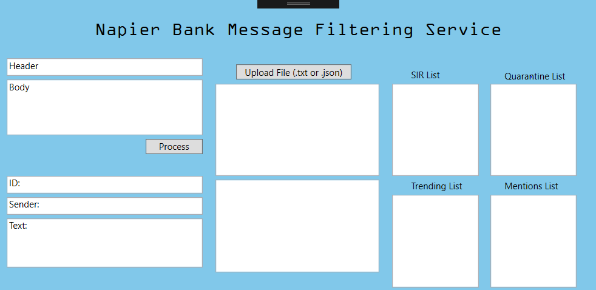

# Napier Bank Message Filtering Service
Coursework 1 for Software Engineering (SET09102) Edinburgh Napier University

The purpose of this coursework is to develop a prototype that will validate, sanitise and categorise incoming messages in the form of SMS, emails and tweets. This report is required to detail:
1. a requirement analysis of the prototype created
2. a class diagram of the system
3. testing of the prototype
4. using version control to support development iteration and team members collaboration
5. an evolution strategy, maintainability of the system, predicted maintenance costs and evolution process and methods

Open this project in  Visual Studio

